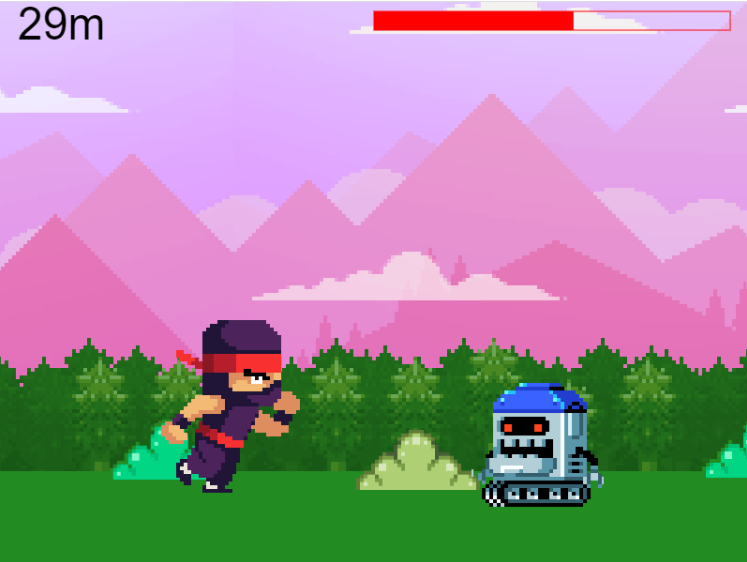

# Nanonaut 🤔

## A simple 2D platform game:

Game for learning JavaScript, running in a web browser 🖥

The game is about one charakter who is a nanonaut.
The nanonaut overcomes endless obstacles and runs in one direction 🕹

Please visit the game website: [Nanonaut](https://przemekjuzwiszin.github.io/nanonauci/)

### Tools & technologies I've used: ⚒

- Visual Studio Code
- GIT
- [Book CoderDojo NANO](https://helion.pl/coderdojo/index.html)
- JavaScript
- Gulp

### I learned something about: 📖

- Console support
- Web browser API use
- Drawing elements on canvas and loading images 
- Braking up code into sections
- Loop config 
- Gravity in the game
- Event handler control
- Instructions: if
- Loops: for, while
- Function overloading and multitasking functions
- Defensive programming
- Update objects randomly 
- Introducing game movement: viewport and scrolling
- Animating: images and speed
- Using arrays, objects, strings
- Collision detection using collision areas
- Using global and local variables
- Lanching end game mode

### Futher development of the game: 📚

- Addition of a nanocoin and coin counter
- Show coin counter and distance in endgame mode on the screen
- Make the game more difficult: adding speed to robots
- New animation where the nanonaut will crouch
- Flying enemies
- Different enemy behavior
- Launching a nanonaut into the air when it collides with a robot

#### Built with wtf-gulp-starter:

[wtf-gulp-starter](https://github.com/maciejkorsan/wtf-gulp-starter)

`npm install -g gulp-cli`

`npm install`

`gulp`

To publish your page using github pages use `npm run deploy`

#### If you are having problems installing npm packages and running gulp. Please follow the instructions below:

1. Clear npm cache with 

`npm cache clean --force`.

2. Install the last version.

`npm install node-sass@latest`

`npm rebuild node-sass`

`npm install`

`gulp`
